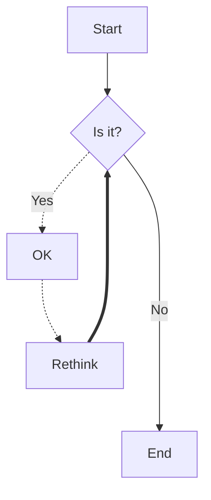

GAdmin

1. 单一模块原则(所有模块中只负责单一的功能，除了共用模块的内容以外，不过多与其他模块耦合)
2. 唯一功能原则(任何模块中的接口，均只提供一个功能实现，并且任何功能的实现均可覆盖重写)
3. 次级模块可删除原则

```mermaid
graph TD
    A[Start] --> B{Is it?};
    B -. Yes .-> C[OK];
    C -.-> D[Rethink];
    D ==> B;
    %% 增加了B到E的长度
    B -- No ----> E[End];
```